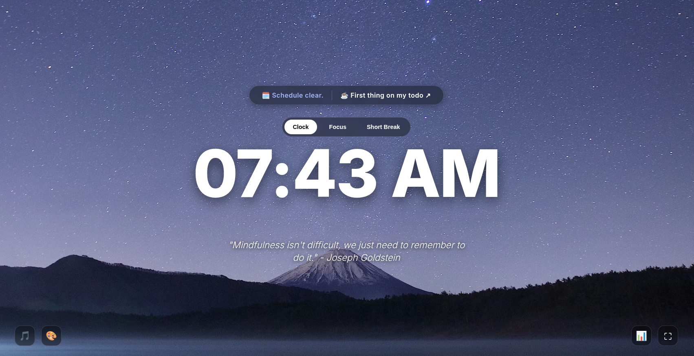

# Zen Focus Dashboard

A minimalist, private, distraction-free homepage built on Google Apps Script. It integrates directly with your Google Calendar and Google Tasks, featuring a built-in Pomodoro timer, ambient soundscapes, and calming backgrounds.

## Features
* **Google Integrations:** Live sync with your next Calendar event and top Priority Task.
* **Focus Tools:** Built-in Pomodoro timer (Focus, Short Break) with ambient sounds (Rain, Cafe).
* **Mindfulness:** Rotating Buddhist and mindfulness quotes.
* **Aesthetics:** Dynamic Unsplash backgrounds (or curated fallbacks) and a clean glassmorphism UI.
* **100% Private:** Runs entirely within your own Google Account sandbox. No external databases.

---

## 🚀 First Deployment (Initial Setup)

1. **Create the Project:**
   * Go to [script.google.com](https://script.google.com/) and click **New Project**.
   * Name it `Zen Focus Dashboard`.
2. **Enable Services:**
   * On the left sidebar, click the `+` next to **Services**.
   * Scroll down, select **Google Tasks API**, and click **Add**. *(Calendar is built-in, but Tasks needs this toggle).*
3. **Add the Code:**
   * Paste the backend code into `Code.gs`.
   * Click the `+` next to **Files**, create an HTML file named `Index` (capital 'I'), and paste the frontend code.
4. **Deploy:**
   * Click the blue **Deploy** button (top right) > **New deployment**.
   * Click the gear icon next to "Select type" and choose **Web app**.
   * Set **Execute as:** `Me`.
   * Set **Who has access:** `Only myself`.
   * Click **Deploy**.
5. **Authorize:**
   * Google will ask for permission to access your Calendar/Tasks. Click **Review Permissions**.
   * Click your account -> **Advanced** -> **Go to Zen Focus Dashboard (unsafe)** -> **Allow**.
6. **Set as Homepage:**
   * Copy the generated **Web app URL**.
   * In Chrome, go to Settings > **On startup** > **Open a specific page or set of pages**, and paste the URL.

---

## 🔄 Later Deployments (Updating the App)

**CRITICAL:** If you change the code and just press "Save," the live webpage will **not** update. You must publish a new version.

1. Make your changes in `Code.gs` or `Index.html` and click the Save icon (💾).
2. Click **Deploy** (top right) > **Manage deployments**.
3. Click the **Pencil Icon** (Edit) next to your active deployment.
4. Under the "Version" dropdown, select **New version**.
5. Click **Deploy**.
6. Refresh your Chrome tab to see the changes.

---
(C) 2026 @sasakuru